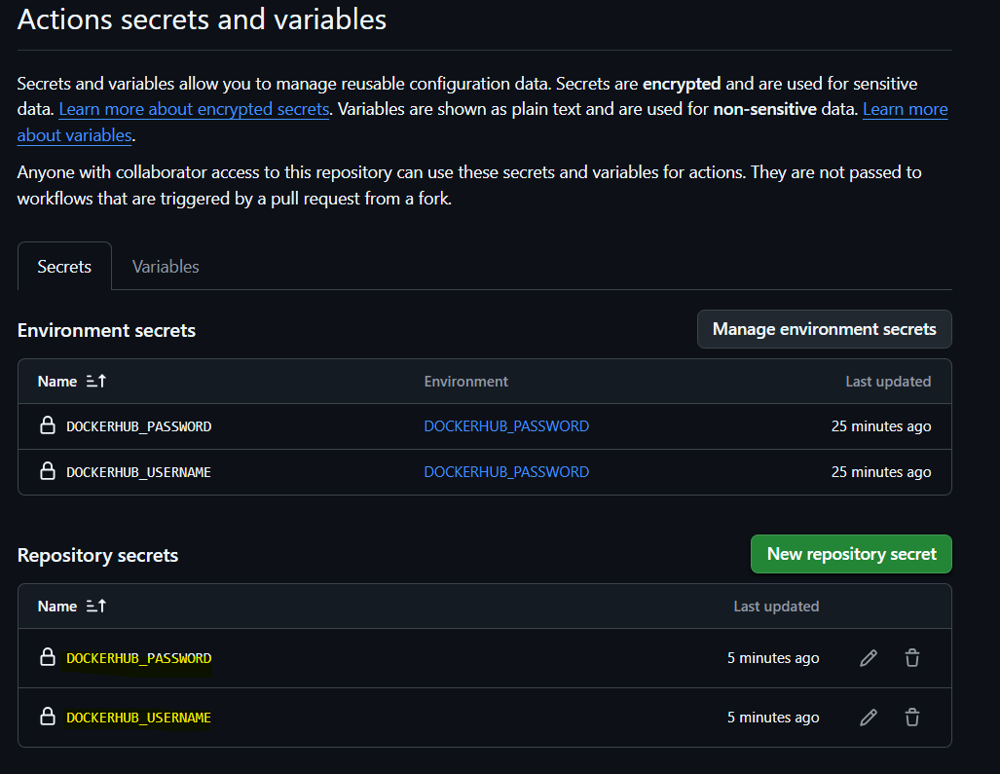
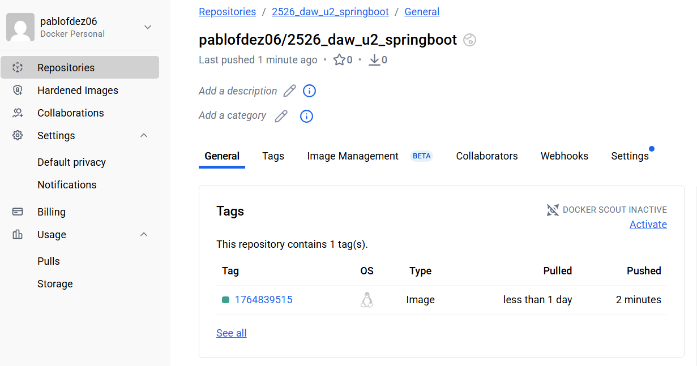
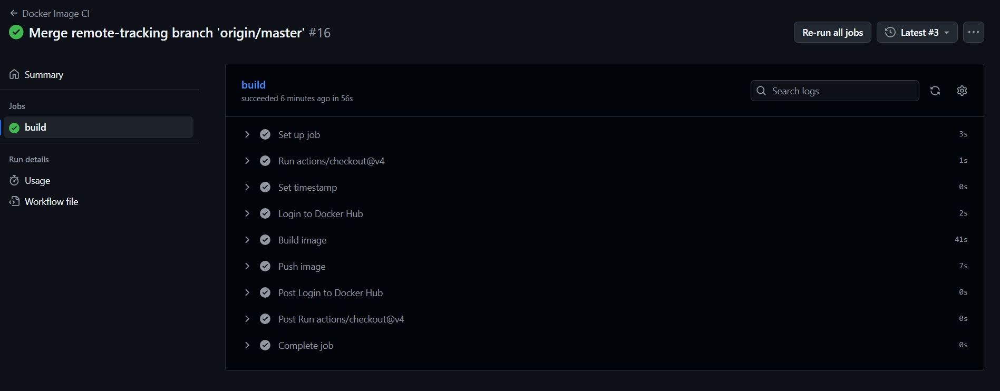

# DOCUMENTACIÓN PROYECTO

En el proyecto he generado un workflow en el que:

Primero nos logueamos en dockerhub:

https://github.com/PabloFdez06/2526_DAW_u2_springboot/blob/6b0246c370c6b51bcec364721a4578d52e36a857/.github/workflows/docker-image.yml#L18-L22

Para ello he creado dos secrets en el repositorio con mi usuario y contraseña de dockerhub:

Después se construye la imagen docker a partir del Dockerfile que teniamos del proyecto:

https://github.com/PabloFdez06/2526_DAW_u2_springboot/blob/6b0246c370c6b51bcec364721a4578d52e36a857/.github/workflows/docker-image.yml#L24-L25

Seguido de esto, lo que hacemos es pushear la imagen a dockerhub:

https://github.com/PabloFdez06/2526_DAW_u2_springboot/blob/6b0246c370c6b51bcec364721a4578d52e36a857/.github/workflows/docker-image.yml#L27-L28

Finalmente, para comprobar que todo ha ido bien, he ido a dockerhub y he visto que la imagen se ha subido correctamente:

Y como comprobación final, verificamos en github que el workflow se ejecuta correctamente sin errores:

## CÓDIGO WORKFLOW COMPLETO

https://github.com/PabloFdez06/2526_DAW_u2_springboot/blob/6b0246c370c6b51bcec364721a4578d52e36a857/.github/workflows/docker-image.yml#L1-L28

