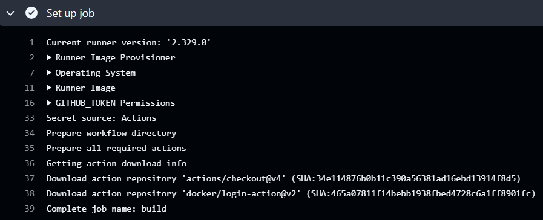
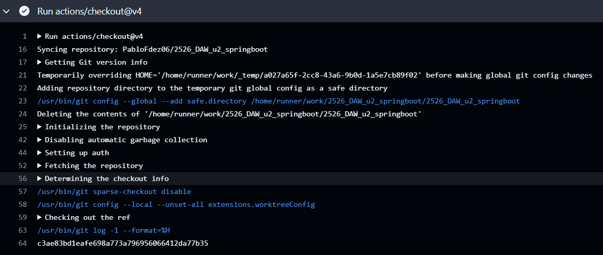
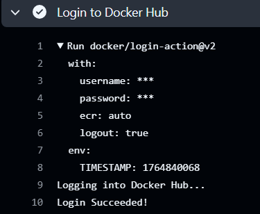
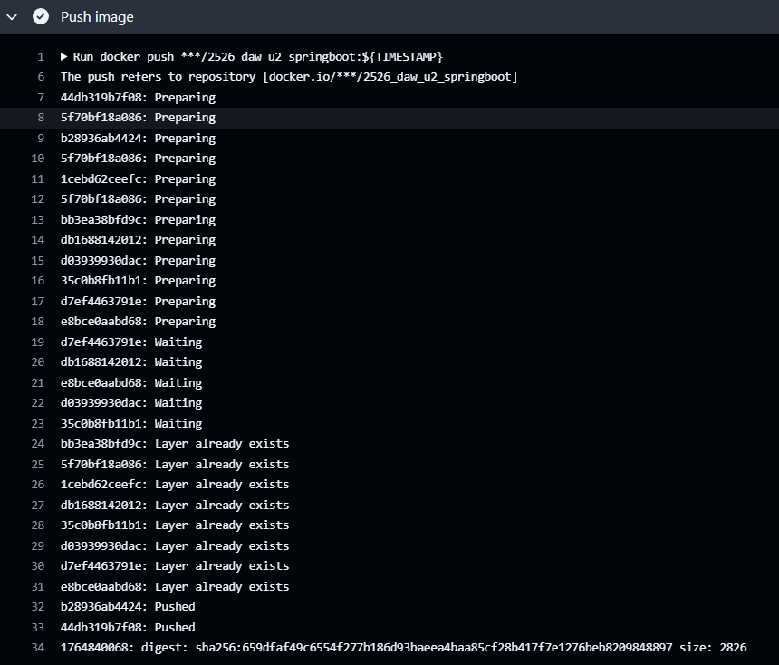
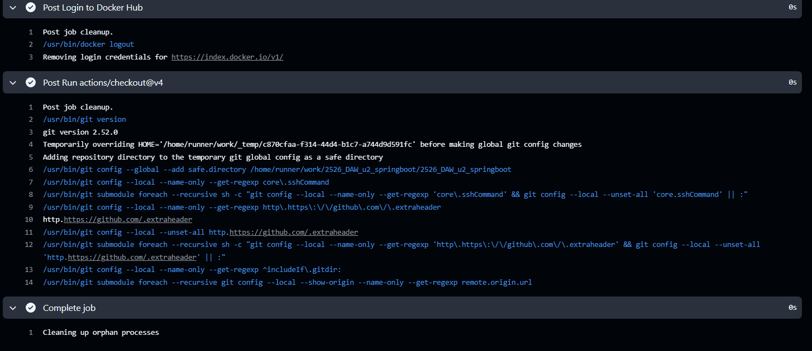

# DOCUMENTACIÓN PROYECTO

En el proyecto he generado un workflow en el que:

Primero nos logueamos en dockerhub:

https://github.com/PabloFdez06/2526_DAW_u2_springboot/blob/6b0246c370c6b51bcec364721a4578d52e36a857/.github/workflows/docker-image.yml#L18-L22

Para ello he creado dos secrets en el repositorio con mi usuario y contraseña de dockerhub:


Después se construye la imagen docker a partir del Dockerfile que teniamos del proyecto:

https://github.com/PabloFdez06/2526_DAW_u2_springboot/blob/6b0246c370c6b51bcec364721a4578d52e36a857/.github/workflows/docker-image.yml#L24-L25

Seguido de esto, lo que hacemos es pushear la imagen a dockerhub:

https://github.com/PabloFdez06/2526_DAW_u2_springboot/blob/6b0246c370c6b51bcec364721a4578d52e36a857/.github/workflows/docker-image.yml#L27-L28

Finalmente, para comprobar que todo ha ido bien, he ido a dockerhub y he visto que la imagen se ha subido correctamente:


Y como comprobación final, verificamos en github que el workflow se ejecuta correctamente sin errores:


# LOGS 

### JOBS




### CHECKOUT@V4



### LOGIN DOCKERHUB



### BUILD IMAGEN

```
Run docker build . --file Dockerfile --tag ***/2526_daw_u2_springboot:${TIMESTAMP}
#0 building with "default" instance using docker driver

#1 [internal] load build definition from Dockerfile
#1 transferring dockerfile: 1.17kB done
#1 DONE 0.0s

#2 [internal] load metadata for docker.io/library/gradle:8.5-jdk17
#2 ...

#3 [auth] library/gradle:pull token for registry-1.docker.io
#3 DONE 0.0s

#4 [auth] library/tomcat:pull token for registry-1.docker.io
#4 DONE 0.0s

#5 [internal] load metadata for docker.io/library/tomcat:10.1-jdk17
#5 ...

#2 [internal] load metadata for docker.io/library/gradle:8.5-jdk17
#2 DONE 1.0s

#5 [internal] load metadata for docker.io/library/tomcat:10.1-jdk17
#5 DONE 1.1s

#6 [internal] load .dockerignore
#6 transferring context: 362B done
#6 DONE 0.0s

#7 [internal] load build context
#7 transferring context: 77.44kB 0.0s done
#7 DONE 0.0s

#8 [builder 1/6] FROM docker.io/library/gradle:8.5-jdk17@sha256:7704366590930c03de7e514008ba3d7b7031b92591bd5a74fae79c16f3a17726
#8 resolve docker.io/library/gradle:8.5-jdk17@sha256:7704366590930c03de7e514008ba3d7b7031b92591bd5a74fae79c16f3a17726 done
#8 sha256:7704366590930c03de7e514008ba3d7b7031b92591bd5a74fae79c16f3a17726 1.21kB / 1.21kB done
#8 sha256:f59836e46ad7a565813de06768ff2884700d12b7ceedacb1701a2983dc859010 2.21kB / 2.21kB done
#8 sha256:521f64de188a3ae1cdf32821464b44693cf9b19cbba5f652a72eb8898353eb88 10.44kB / 10.44kB done
#8 sha256:26611c45681a8966387aee7b2e1494405e20bc5a46dc5da0af9228c45f8e8ec4 0B / 17.46MB 0.1s
#8 sha256:31bd5f451a847d651a0996256753a9b22a6ea8c65fefb010e77ea9c839fe2fac 0B / 30.45MB 0.1s
#8 sha256:0a1f4ac6e69541680073b21e32dd3de17885de514e36838468fe84707c7b5acf 0B / 144.90MB 0.1s
#8 sha256:26611c45681a8966387aee7b2e1494405e20bc5a46dc5da0af9228c45f8e8ec4 4.19MB / 17.46MB 0.3s
#8 sha256:26611c45681a8966387aee7b2e1494405e20bc5a46dc5da0af9228c45f8e8ec4 5.24MB / 17.46MB 0.4s
#8 sha256:31bd5f451a847d651a0996256753a9b22a6ea8c65fefb010e77ea9c839fe2fac 6.29MB / 30.45MB 0.4s
#8 sha256:0a1f4ac6e69541680073b21e32dd3de17885de514e36838468fe84707c7b5acf 7.34MB / 144.90MB 0.4s
#8 sha256:26611c45681a8966387aee7b2e1494405e20bc5a46dc5da0af9228c45f8e8ec4 9.44MB / 17.46MB 0.5s
#8 sha256:31bd5f451a847d651a0996256753a9b22a6ea8c65fefb010e77ea9c839fe2fac 12.58MB / 30.45MB 0.5s
#8 sha256:0a1f4ac6e69541680073b21e32dd3de17885de514e36838468fe84707c7b5acf 16.78MB / 144.90MB 0.5s
#8 sha256:26611c45681a8966387aee7b2e1494405e20bc5a46dc5da0af9228c45f8e8ec4 17.46MB / 17.46MB 0.7s done
#8 sha256:31bd5f451a847d651a0996256753a9b22a6ea8c65fefb010e77ea9c839fe2fac 28.31MB / 30.45MB 0.7s
#8 sha256:0a1f4ac6e69541680073b21e32dd3de17885de514e36838468fe84707c7b5acf 33.55MB / 144.90MB 0.7s
#8 sha256:a36c85a96a6da44b1c1559a390715fd929fae60db504c8b9c745897d737ca485 0B / 173B 0.7s
#8 sha256:31bd5f451a847d651a0996256753a9b22a6ea8c65fefb010e77ea9c839fe2fac 30.45MB / 30.45MB 0.8s done
#8 sha256:0a1f4ac6e69541680073b21e32dd3de17885de514e36838468fe84707c7b5acf 40.89MB / 144.90MB 0.8s
#8 sha256:30d3df2ee4d87245e77cfd06e96a597422956e0194064b0b71152e77d117ff54 0B / 733B 0.8s
#8 extracting sha256:31bd5f451a847d651a0996256753a9b22a6ea8c65fefb010e77ea9c839fe2fac
#8 sha256:0a1f4ac6e69541680073b21e32dd3de17885de514e36838468fe84707c7b5acf 48.23MB / 144.90MB 0.9s
#8 sha256:a36c85a96a6da44b1c1559a390715fd929fae60db504c8b9c745897d737ca485 173B / 173B 0.9s done
#8 sha256:d07f8a99f32569a5ebfa8e9c3f4da0166c21ab862fab70f288cac5905e4d76f4 0B / 4.36kB 0.9s
#8 sha256:30d3df2ee4d87245e77cfd06e96a597422956e0194064b0b71152e77d117ff54 733B / 733B 0.9s done
#8 sha256:aad08408064ed46f64df063070cbdca2e9c201ef791fca8b24f281c176dd595c 0B / 51.55MB 1.0s
#8 sha256:0a1f4ac6e69541680073b21e32dd3de17885de514e36838468fe84707c7b5acf 62.91MB / 144.90MB 1.1s
#8 sha256:d07f8a99f32569a5ebfa8e9c3f4da0166c21ab862fab70f288cac5905e4d76f4 4.36kB / 4.36kB 1.0s done
#8 sha256:f5b1cf504e03486f25a93789e25d170596a30a0bcddc7396219539ae4d3a3e3b 0B / 132.54MB 1.1s
#8 sha256:0a1f4ac6e69541680073b21e32dd3de17885de514e36838468fe84707c7b5acf 71.30MB / 144.90MB 1.2s
#8 sha256:0a1f4ac6e69541680073b21e32dd3de17885de514e36838468fe84707c7b5acf 79.69MB / 144.90MB 1.3s
#8 sha256:aad08408064ed46f64df063070cbdca2e9c201ef791fca8b24f281c176dd595c 7.34MB / 51.55MB 1.3s
#8 sha256:f5b1cf504e03486f25a93789e25d170596a30a0bcddc7396219539ae4d3a3e3b 7.34MB / 132.54MB 1.3s
#8 sha256:0a1f4ac6e69541680073b21e32dd3de17885de514e36838468fe84707c7b5acf 88.08MB / 144.90MB 1.4s
#8 sha256:aad08408064ed46f64df063070cbdca2e9c201ef791fca8b24f281c176dd595c 17.83MB / 51.55MB 1.4s
#8 sha256:f5b1cf504e03486f25a93789e25d170596a30a0bcddc7396219539ae4d3a3e3b 15.73MB / 132.54MB 1.4s
#8 sha256:0a1f4ac6e69541680073b21e32dd3de17885de514e36838468fe84707c7b5acf 108.12MB / 144.90MB 1.6s
#8 sha256:aad08408064ed46f64df063070cbdca2e9c201ef791fca8b24f281c176dd595c 38.80MB / 51.55MB 1.6s
#8 sha256:f5b1cf504e03486f25a93789e25d170596a30a0bcddc7396219539ae4d3a3e3b 35.65MB / 132.54MB 1.6s
#8 sha256:0a1f4ac6e69541680073b21e32dd3de17885de514e36838468fe84707c7b5acf 124.78MB / 144.90MB 1.8s
#8 sha256:aad08408064ed46f64df063070cbdca2e9c201ef791fca8b24f281c176dd595c 51.55MB / 51.55MB 1.7s done
#8 sha256:f5b1cf504e03486f25a93789e25d170596a30a0bcddc7396219539ae4d3a3e3b 54.53MB / 132.54MB 1.8s
#8 sha256:f43bfc2819ff808463a651fd1b0d4343062dcbc80dffcd07fb360ca66f98626b 0B / 170B 1.8s
#8 sha256:0a1f4ac6e69541680073b21e32dd3de17885de514e36838468fe84707c7b5acf 135.27MB / 144.90MB 1.9s
#8 sha256:f5b1cf504e03486f25a93789e25d170596a30a0bcddc7396219539ae4d3a3e3b 65.01MB / 132.54MB 1.9s
#8 sha256:0a1f4ac6e69541680073b21e32dd3de17885de514e36838468fe84707c7b5acf 144.90MB / 144.90MB 2.0s
#8 extracting sha256:31bd5f451a847d651a0996256753a9b22a6ea8c65fefb010e77ea9c839fe2fac 1.1s done
#8 sha256:f5b1cf504e03486f25a93789e25d170596a30a0bcddc7396219539ae4d3a3e3b 73.40MB / 132.54MB 2.0s
#8 sha256:f43bfc2819ff808463a651fd1b0d4343062dcbc80dffcd07fb360ca66f98626b 170B / 170B 1.9s done
#8 extracting sha256:26611c45681a8966387aee7b2e1494405e20bc5a46dc5da0af9228c45f8e8ec4
#8 sha256:0a1f4ac6e69541680073b21e32dd3de17885de514e36838468fe84707c7b5acf 144.90MB / 144.90MB 2.1s done
#8 sha256:f5b1cf504e03486f25a93789e25d170596a30a0bcddc7396219539ae4d3a3e3b 91.84MB / 132.54MB 2.2s
#8 sha256:f5b1cf504e03486f25a93789e25d170596a30a0bcddc7396219539ae4d3a3e3b 103.81MB / 132.54MB 2.3s
#8 sha256:f5b1cf504e03486f25a93789e25d170596a30a0bcddc7396219539ae4d3a3e3b 112.20MB / 132.54MB 2.4s
#8 sha256:f5b1cf504e03486f25a93789e25d170596a30a0bcddc7396219539ae4d3a3e3b 122.22MB / 132.54MB 2.5s
#8 sha256:f5b1cf504e03486f25a93789e25d170596a30a0bcddc7396219539ae4d3a3e3b 131.07MB / 132.54MB 2.6s
#8 sha256:f5b1cf504e03486f25a93789e25d170596a30a0bcddc7396219539ae4d3a3e3b 132.54MB / 132.54MB 2.7s done
#8 extracting sha256:26611c45681a8966387aee7b2e1494405e20bc5a46dc5da0af9228c45f8e8ec4 1.3s done
#8 extracting sha256:0a1f4ac6e69541680073b21e32dd3de17885de514e36838468fe84707c7b5acf
#8 extracting sha256:0a1f4ac6e69541680073b21e32dd3de17885de514e36838468fe84707c7b5acf 1.5s done
#8 extracting sha256:a36c85a96a6da44b1c1559a390715fd929fae60db504c8b9c745897d737ca485
#8 extracting sha256:a36c85a96a6da44b1c1559a390715fd929fae60db504c8b9c745897d737ca485 done
#8 extracting sha256:30d3df2ee4d87245e77cfd06e96a597422956e0194064b0b71152e77d117ff54 done
#8 extracting sha256:d07f8a99f32569a5ebfa8e9c3f4da0166c21ab862fab70f288cac5905e4d76f4 done
#8 extracting sha256:aad08408064ed46f64df063070cbdca2e9c201ef791fca8b24f281c176dd595c
#8 ...

#9 [stage-1 1/4] FROM docker.io/library/tomcat:10.1-jdk17@sha256:d2cd0027e6b828ad8a5ff7693a20d972f16af0139f7fcecafa0797b31809863e
#9 resolve docker.io/library/tomcat:10.1-jdk17@sha256:d2cd0027e6b828ad8a5ff7693a20d972f16af0139f7fcecafa0797b31809863e done
#9 sha256:d2cd0027e6b828ad8a5ff7693a20d972f16af0139f7fcecafa0797b31809863e 7.97kB / 7.97kB done
#9 sha256:5555010508e0938564d9a2fc6d7c0c3386c896743c142c207014f9b4d1a05a5b 2.72kB / 2.72kB done
#9 sha256:d7e557a209e888a501219479852f290c330a1621b70dfd293cda06f75601789b 13.03kB / 13.03kB done
#9 sha256:20043066d3d5c78b45520c5707319835ac7d1f3d7f0dded0138ea0897d6a3188 29.72MB / 29.72MB 2.5s done
#9 sha256:077c4ca28173a06771936e7d2dd6254602c0fa1edee45debed984b4b382915de 22.96MB / 22.96MB 2.6s done
#9 extracting sha256:20043066d3d5c78b45520c5707319835ac7d1f3d7f0dded0138ea0897d6a3188 1.3s done
#9 sha256:b88b6ae1b108522b13f2cdc7912b1e5784e2a63268ea6d6d967b4e562b803b6f 144.85MB / 144.85MB 6.1s done
#9 sha256:67cf99ea3a756f77f1989a181feed90c517d46369d9430b6d37e86797f650a47 159B / 159B 2.9s done
#9 sha256:02d80376fd82870628b01ae6f01bd27552bc9aa3a4cd5be88515f79fe298a87a 2.28kB / 2.28kB 2.9s done
#9 sha256:ba09cd1b52686ac9e9dbb220adb4ab688596c111fa8403f9fb633cbfbdee0eee 139B / 139B 3.1s done
#9 sha256:4f4fb700ef54461cfa02571ae0db9a0dc1e0cdb5577484a6d75e68dc38e8acc1 32B / 32B 3.1s done
#9 sha256:6431d88ca8c2ceaed69970f6c943b1b6f48e0a66b8750f8654bd2bf0c977be68 14.34MB / 14.34MB 3.5s done
#9 extracting sha256:077c4ca28173a06771936e7d2dd6254602c0fa1edee45debed984b4b382915de 1.0s done
#9 extracting sha256:b88b6ae1b108522b13f2cdc7912b1e5784e2a63268ea6d6d967b4e562b803b6f 1.4s done
#9 extracting sha256:67cf99ea3a756f77f1989a181feed90c517d46369d9430b6d37e86797f650a47 done
#9 extracting sha256:02d80376fd82870628b01ae6f01bd27552bc9aa3a4cd5be88515f79fe298a87a done
#9 extracting sha256:ba09cd1b52686ac9e9dbb220adb4ab688596c111fa8403f9fb633cbfbdee0eee done
#9 extracting sha256:4f4fb700ef54461cfa02571ae0db9a0dc1e0cdb5577484a6d75e68dc38e8acc1 done
#9 extracting sha256:6431d88ca8c2ceaed69970f6c943b1b6f48e0a66b8750f8654bd2bf0c977be68 0.3s done
#9 DONE 8.7s

#8 [builder 1/6] FROM docker.io/library/gradle:8.5-jdk17@sha256:7704366590930c03de7e514008ba3d7b7031b92591bd5a74fae79c16f3a17726
#8 ...

#10 [stage-1 2/4] RUN mkdir -p /app/data
#10 DONE 0.2s

#8 [builder 1/6] FROM docker.io/library/gradle:8.5-jdk17@sha256:7704366590930c03de7e514008ba3d7b7031b92591bd5a74fae79c16f3a17726
#8 extracting sha256:aad08408064ed46f64df063070cbdca2e9c201ef791fca8b24f281c176dd595c 2.8s done
#8 ...

#11 [stage-1 3/4] RUN rm -rf /usr/local/tomcat/webapps/*
#11 DONE 0.1s

#8 [builder 1/6] FROM docker.io/library/gradle:8.5-jdk17@sha256:7704366590930c03de7e514008ba3d7b7031b92591bd5a74fae79c16f3a17726
#8 extracting sha256:f5b1cf504e03486f25a93789e25d170596a30a0bcddc7396219539ae4d3a3e3b 0.1s
#8 extracting sha256:f5b1cf504e03486f25a93789e25d170596a30a0bcddc7396219539ae4d3a3e3b 0.6s done
#8 extracting sha256:f43bfc2819ff808463a651fd1b0d4343062dcbc80dffcd07fb360ca66f98626b
#8 extracting sha256:f43bfc2819ff808463a651fd1b0d4343062dcbc80dffcd07fb360ca66f98626b done
#8 DONE 9.8s

#12 [builder 2/6] WORKDIR /app
#12 DONE 0.0s

#13 [builder 3/6] COPY build.gradle settings.gradle gradlew ./
#13 DONE 0.0s

#14 [builder 4/6] COPY gradle ./gradle
#14 DONE 0.0s

#15 [builder 5/6] COPY src ./src
#15 DONE 0.0s

#16 [builder 6/6] RUN chmod +x gradlew && ./gradlew bootWar --no-daemon
#16 0.197 Downloading https://services.gradle.org/distributions/gradle-8.14.3-bin.zip
#16 0.856 .............10%.............20%.............30%.............40%.............50%.............60%.............70%.............80%.............90%..............100%
#16 3.004 
#16 3.004 Welcome to Gradle 8.14.3!
#16 3.005 
#16 3.005 Here are the highlights of this release:
#16 3.005  - Java 24 support
#16 3.005  - GraalVM Native Image toolchain selection
#16 3.005  - Enhancements to test reporting
#16 3.006  - Build Authoring improvements
#16 3.006 
#16 3.006 For more details see https://docs.gradle.org/8.14.3/release-notes.html
#16 3.006 
#16 3.104 To honour the JVM settings for this build a single-use Daemon process will be forked. For more on this, please refer to https://docs.gradle.org/8.14.3/userguide/gradle_daemon.html#sec:disabling_the_daemon in the Gradle documentation.
#16 4.203 Daemon will be stopped at the end of the build 
#16 26.41 > Task :compileJava
#16 26.41 > Task :processResources
#16 26.41 > Task :classes
#16 26.41 > Task :resolveMainClassName
#16 27.30 > Task :bootWar
#16 27.30 
#16 27.30 BUILD SUCCESSFUL in 27s
#16 27.30 4 actionable tasks: 4 executed
#16 DONE 27.5s

#17 [stage-1 4/4] COPY --from=builder /app/build/libs/*.war /usr/local/tomcat/webapps/ROOT.war
#17 DONE 0.0s

#18 exporting to image
#18 exporting layers
#18 exporting layers 0.8s done
#18 writing image sha256:7177dee5395afa0dec3411665a0477c7d4667eb689d12672b60a22fdbfc1f6ad done
#18 naming to docker.io/***/2526_daw_u2_springboot:1764840068 done
#18 DONE 0.8s
```

### PUSH DE LA IMAGEN



### POSTS Y COMPLETE



## CÓDIGO WORKFLOW COMPLETO

https://github.com/PabloFdez06/2526_DAW_u2_springboot/blob/6b0246c370c6b51bcec364721a4578d52e36a857/.github/workflows/docker-image.yml#L1-L28

